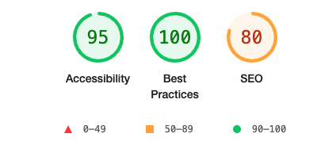

# <ins>*ClassifyBooking*</ins> - booking system

## <ins>About ClassifyBooking</ins>
ClassifyBooking is an online booking system for a local gym that allows the coaches to create classes/events and allows the users to book onto these and log their results/scores.

This project will be used as my capstone project for the Code Institute skills bootcamp. It will be a full stack Python Django application.

The target user for this project will be a gym owner who runs a gym like the CrossFit gym I attend. This is where they have regular classes and times, and these can be managed by the owner and their clients can reserve spaces and log progress.

<ins>Deployed site link: </ins>[ClassifyBooking](https://classifybooking-2be97a09d742.herokuapp.com/)

## <ins>Contents</ins>

- [Project planning](#project-planning)
- [UX](#user-experience-ux)
- [Technologies used](#technologies-used)
- [Features](#features)
- [Testing](#testing)
- [Impact of AI Analysis](#impact-of-ai-analysis)
- [Deployment](#deployment)
- [Credits](#credits)
- [Evaluation](#evaluation)

## <ins>Project Planning</ins>

[Click here to view the project board](https://github.com/users/judewoolls/projects/10/views/1)

### Agile Development

This project follows an agile development methodology, which emphasises iterative development and flexibility. Agile development allows us to adapt to changing requirements and deliver value to users more quickly.

### User Stories

User stories are organised by priority to ensure that the most critical features are developed first.

#### Must-Have

1. **Classes displayed chronologically**
   - As a gym member, I want to see the classes displayed in chronological order by date and time so that I can easily find and plan for upcoming sessions.
   - **Acceptance criteria**:
     - Classes are sorted by time in ascending order, with the earliest time appearing first.
     - The user can search through by date.
     - Classes are displayed under the correct date
     - The class list updates dynamically as new classes are added or past classes expire.

2. **Create a log in page**
   - As a gym member, I want to log in securely so that I can access personalized features like booking and managing my classes.
   - **Acceptance criteria**:
     - The application has a dedicated login page accessible from the navigation bar or homepage.
     - Users log in using their email/username and password.
     - Login credentials are validated securely, and incorrect credentials display an appropriate error message.
     - Upon successful login, users are redirected to the main dashboard or class listing page.
     - Logged-in users can access personalized features, such as viewing their bookings and managing reservations.
     - A "Remember Me" option is available for convenience (optional).

3. **Use the book button to create a booking**
   - As a gym member, I want to use a "Book" button to reserve a spot in a class so that I can easily secure my place.
   - **Acceptance criteria**:
     - Each class displays a "Book" button if there are remaining spots available.
     - Clicking the "Book" button creates a booking for the logged-in user.
     - After booking, the system updates the remaining capacity for the class.
     - If a class is fully booked, the "Book" button is disabled or replaced with a "Fully Booked" label.
     - A confirmation message is displayed to the user after a successful booking.

4. **User Authentication**
   - As a gym member or admin, I want to securely log in and out of the platform, so that I can access my personal bookings, scores, and other features relevant to my role.
   - **Acceptance criteria**:
     - Role-Based Access: Upon login, users are directed to their dashboard, and features are customized based on their role (e.g., member or coach).
     - Authentication Feedback: Users see feedback such as “Logged in successfully” or “Incorrect password.”

5. **Display the class capacity**
   - As a gym member, I want to see the total capacity of a class and the number of remaining spots so that I can know if I can book a place.
   - **Acceptance criteria**:
     - Each class displays the total capacity (e.g., "Capacity: 20").
     - The number of remaining spots is displayed dynamically (e.g., "Spots Available: 5").
     - If the class is fully booked, it clearly shows "Fully Booked" instead of available spots.
     - The displayed capacity and remaining spots update automatically as users book or cancel classes.

6. **Display cancel button if already booked**
   - As a gym member, I want to see a "Cancel" button for classes I’ve already booked so that I can easily manage my reservations.
   - **Acceptance criteria**:
     - If the user has already booked a class, the "Cancel" button is displayed instead of the "Book" button.
     - Clicking the "Cancel" button removes the user's booking for that class.
     - After cancellation, the system updates the remaining capacity for the class.
     - A confirmation message is displayed after a successful cancellation.
     - The "Cancel" button is replaced with the "Book" button once the user cancels their booking.

7. **Add a logbook form to submit scores**
   - As a gym member, I want a logbook to record the weights and reps I complete during workouts so that I can track my progress over time.
   - **Acceptance criteria**:
     - A "Logbook" page is accessible from the navigation bar.
     - Users can log the following details for each entry:
       - Exercise name
       - Weight (kg or lbs)
       - Number of reps
     - Logs are saved to the database and displayed in a list ordered by date (most recent first).
     - Users can edit or delete previous entries.
     - If no entries exist, a message like "No logs yet. Start tracking your workouts!" is displayed.

8. **Add an edit feature to change logbook scores**
   - As a gym member, I want to edit my logbook entries so that I can correct mistakes or update my progress as needed.
   - **Acceptance criteria**:
     - Each log entry has an "Edit" button next to it.
     - Clicking the "Edit" button takes the user to a form pre-filled with the log entry details.
     - The user can change the exercise name, weight, reps, and notes.
     - Changes are saved to the database and reflected immediately in the logbook.
     - A confirmation message is displayed after successful edits.

#### Should-Have

1. **Coaches can manage classes**
   - As a Coach, I can add classes so that my clients can book onto events.
   - **Acceptance criteria**:
     - A visible add classes button (only visible to coaches)
     - This takes to form and can add event
     - Events can be edited/updated
     - Events can be deleted

2. **Display recent scores in logbook**
   - As a gym member, I want to see my most recent scores at the top of the logbook so that I can quickly view my latest progress.
   - **Acceptance criteria**:
     - The most recent log entries appear at the top of the logbook page.
     - Recent scores are displayed with their exercise name, weight, reps, and date.
     - If no entries exist, a message like "No recent scores available" is shown.

3. **Homepage**
   - As a gym member, I want the homepage to display my upcoming bookings and recent scores so that I can stay updated on my schedule and track my progress.
   - **Acceptance criteria**:
     - The homepage is the first page users see after logging in.
     - The "Upcoming Bookings" section lists all the classes the user has booked, ordered by date and time (soonest first).
     - Each booking includes the class name, date and time.
     - If there are no upcoming bookings, the section displays a message like "No upcoming bookings."
     - The "Recent Scores" section displays the user's latest performance scores (e.g., workout results, personal bests).
     - Each score includes the event name, date, and score achieved.
     - If there are no scores, the section displays a message like "No recent scores."
     - Both sections are styled for clarity and responsive design.

#### Could-Have

1. **Compare scores to other users**
   - As a gym member, I want to compare my performance scores with other gym members, so that I can gauge how my progress measures up against others and stay motivated.
   - **Acceptance criteria**:
     - There should be a leaderboard showing the top-performing gym members based on certain scores (e.g., highest weight lifted, most reps, etc.).
     - The leaderboard should be sortable by different categories (e.g., by exercise, by rep range, by total score).

### URL Planning

For this project, the URL and navigation planning was essential as this could cause many issues during development if it was not thought out and followed a logical flow. So for each app, they would have their own URLs file.

#### Booking App

- `booking/datestring/` - used to display the available classes on a given date
- `booking/datestring/eventid/` - used to display the event details of the selected event
- `booking/edit_event/eventid/` - used by only selected users to edit classes
- `booking/create_event/` - used by only specific users to create new classes that other users can book onto
- `booking/delete_event/eventid/` - used to delete an event
- `booking/cancel_event/eventid/` - used to cancel a booking

#### Log Book App

- `logbook/` - used to go to the main logbook page that displays scores and new score form
- `logbook/edit_score/id/` - used to display form to enter an edited score
- `logbook/delete_score/id/` - used to delete that score

#### Home App

- `''` - used to display the home page after log in then using the nav bar and buttons on the home page view the other apps

## User Experience (UX)

### Overview

The goal of the UX design is to ensure that users can quickly and easily navigate between the booking system and logbook. The design focuses on simplicity, clarity, and ease of use. Below are the key points and wireframes that guided the development of the site.

### Key Points

1. **Intuitive Navigation**: Users should be able to navigate between the booking system and logbook with minimal effort.
2. **Consistency**: The design should be consistent across all pages to provide a seamless experience.
3. **Accessibility**: The site should be accessible to all users, including those with disabilities.
4. **Responsiveness**: The site should be fully responsive, providing a good experience on both desktop and mobile devices.
5. **Feedback**: Users should receive immediate feedback on their actions, such as booking a class or logging a score.

### Wireframes

The main pages are shown in these three wireframes:

#### Home Page

The home page serves as the central hub where users can view their upcoming bookings and recent scores. It provides quick access to the booking system and logbook.

#### Booking Page

The booking page allows users to browse and book classes. It provides detailed information about each class, including the coach, time, and capacity.

#### Logbook Page

The logbook page enables users to track and compare their fitness scores. It provides a history of their scores and allows them to add new entries.

### Additional UX Considerations

1. **User Onboarding**: Provide a simple and clear onboarding process for new users to help them get started quickly.
2. **Error Handling**: Ensure that error messages are clear and helpful, guiding users on how to correct any issues.
3. **Loading States**: Use loading indicators to inform users when data is being fetched or actions are being processed.
4. **User Feedback**: Collect user feedback regularly to identify pain points and areas for improvement.
5. **Performance**: Optimize the site for fast loading times to enhance the user experience.

By focusing on these UX principles, we aim to create a user-friendly and efficient platform that meets the needs of our users.

## <ins>Technologies Used</ins>

The site was deployed using **Heroku web services** and used **GitHub** for version control.

ClassifyBooking was developed using the Python framework **Django** on the backend working with a **Postgres database**. For the frontend, I made use of **HTML**, **CSS**, **JavaScript**, and I also used the **Bootstrap framework** to improve development speed and allow the project to be responsive. Another key factor in speeding up the development was the use of AI. The main AI tools used were ChatGPT and GitHub Copilot. I will go into further detail about the impact of these tools [here.](#impact-of-ai-analysis)

## <ins>Features</ins>

### Main functionality
For the ClassifyBooking app, the key features are the coach being able to set up the classes and for the user to book onto the class. These classes are displayed and styled using Bootstrap for quicker development speed. The classes are displayed in the booking app, and the events for each day are displayed under the corresponding date and are ordered chronologically.

For the user, the booking button is displayed, and they can click on the button to book onto the event or click on the event title to view the event details. For the coach, the cancel button is displayed to delete the event from the database.

The coach also has an additional button which is the create event button that can be used to access the form to add a class. The coach also has access to an edit event button when viewing the event details. This takes them to a similar form that can be used to adjust the details of that event.

### Booking app

<ins>Searching for events</ins>

<ins>Class card</ins>

### Coach class management features

<ins>Add Class Form</ins>- Appears after add event button is clicked

<ins>Edit Class Form</ins>- Appears after edit event button is clicked

<ins>Class Details</ins>- Appears after the event title is clicked

<ins>Class card</ins>- This is how the class event appears in the app

### The logbook

The app also provides access to the logbook. The log displays a form to submit scores for exercises. These scores consist of exercise name, number of reps, and the weight in kilograms. The score can then be added to the database. The three most recent scores are presented next to the form, and below is a list of all the user's scores. Each score can also be edited or deleted.

<ins>Logbook display</ins>

<ins>Edit score form</ins>

### The Homepage

The homepage is used to display the user's three soonest upcoming bookings and most recent scores. Below this is the leaderboard. The leaderboard accesses all the scores from all users and can be filtered through for each exercise, the minimum weight, and reps.

<ins>The homepage also has a leaderboard that allows you to filter through scores</ins>

### Nav bar

The nav bar has fully functioning links to different pages.

### Login functionality

The app has full user authentication.

<ins>The log in page</ins>

### Footer

The footer has links that currently redirect to the top of the page. This can be replaced with the gym's real social media links and address.

## <ins>Testing</ins>

### <ins>Responsiveness Testing</ins>

#### For mobile and tablet

#### For desktop

### <ins>HTML Validation</ins>
All the pages passed with the following message:

### <ins>CSS Validation</ins>

### <ins>Accessibility Scores</ins>

### <ins>Performance Scores</ins>

### <ins>Python Standards</ins>

Main Python:
- Each Python file has been validated to PEP8 standards 

Testing Python:
- Each Python file has been validated to PEP8 standards

### <ins>Automated unit tests</ins>

The project has a total of 26 unit tests to test the functionality of the application. As of the most recent deployment all of the tests pass. The tests uses mock data on a separate database used exclusively for testing to avoid the test affecting the database for the deployed site.

The unit tests were used to verify the following functionalities:

1. **Class Booking**:
  - Verify that users can book classes and that the booking status updates correctly.
  - Test the display of available spots and the "Fully Booked" status.

2. **Class Management**:
  - Ensure that coaches can create, edit, and delete classes.
  - Verify that class details are correctly displayed and updated.

3. **Logbook Entries**:
  - Test the creation, editing, and deletion of logbook entries.
  - Ensure that log entries are saved and displayed correctly.

4. **Homepage Display**:
  - Verify that the homepage correctly displays upcoming bookings and recent scores.
  - Test the leaderboard functionality and filtering options.

5. **Navigation and URLs**:
  - Ensure that all navigation links and URLs work as expected.
  - Test access control for different user roles (e.g., member vs. coach).

6. **Form Validations**:
  - Verify that all forms have appropriate validation and error handling.
  - Ensure that invalid data is not accepted and proper error messages are shown.

These tests ensure that the core functionalities of the application work as intended and provide a reliable user experience.

> Here is the result of running the tests:
>
> 

## <ins>Impact of AI Analysis</ins>

> The main tools used:
>
> - ChatGPT
> - GitHub Copilot

### What did these tools add to the project?

ChatGPT was invaluable for brainstorming ideas and providing feedback on various aspects of the project. For example, when designing the database models, ChatGPT suggested using Django's auto-incrementing ID feature and provided the correct naming conventions. This not only saved development time but also ensured that best practices were followed.

GitHub Copilot was particularly helpful for debugging code and filling in syntax details that I might have missed. It was able to suggest corrections and improvements, which sped up the development process and reduced the number of errors. Furthermore, Copilot helped to make the unit tests when given clear prompts this really helped speed up the testing process.

### What were the downsides?

The primary risk when using Copilot was the potential for misunderstanding the suggested changes. It was crucial to review and understand the code before integrating it into the project. By being cautious and only accepting suggestions I fully understood, I was able to mitigate this risk.

With ChatGPT, one challenge was ensuring consistency with variable names and project-specific conventions. For instance, when implementing the events/classes booking system, ChatGPT provided code snippets that used different variable names from those in my project. This required additional time to adapt the suggestions to fit my existing codebase.

Another issue arose when passing dates from Django to JavaScript. Initially, there were difficulties in converting the date format to the required format, which took some time to resolve.

### Conclusion

Overall, the use of AI tools like ChatGPT and GitHub Copilot significantly enhanced the development process by providing valuable insights, suggestions, and debugging assistance. While there were some challenges, careful review and adaptation of the AI-generated code ensured that the project benefited from these tools without compromising quality.

## <ins>Deployment</ins>

### Deployment Process

The ClassifyBooking project was deployed using Heroku, a cloud platform that enables developers to build, run, and operate applications entirely in the cloud. Below are the steps taken to deploy the project:

1. **Prepare the Application**: Ensure all dependencies are listed in the `requirements.txt` file and the application is configured to use a PostgreSQL database in production.

2. **Create a Heroku Account**: Sign up for a Heroku account and create a new app.

3. **Set Debug to False in settings**: If not already done, to prevent debugging messages displayed in the production app.

4. **Initialize a Git Repository**: If not already done, initialize a Git repository in the project directory and commit all changes.

5. **Set Up Environment Variables**: Configure necessary environment variables such as `DATABASE_URL`, `SECRET_KEY`, and any other settings required for the Django application.

6. **Run Migrations**: Apply database migrations on Heroku with the command `python3 manage.py migrate`.

7. **Collect Static Files**: Collect static files for the application with the command `python3 manage.py collectstatic`.

8. **Click Deploy**: Once deployed, open the application in a web browser using open button.

By following these steps, the ClassifyBooking project was successfully deployed and made accessible to users.

## <ins>Credits</ins>

>Thanks to [Code Institute](https://github.com/Code-Institute-Solutions/blog/tree/main/11_authorisation/03_custom_template/templates) for the log in and sign up page templates

>The browser icon: [Gymnastic icons created by Hexagon075 - Flaticon](https://www.flaticon.com/free-icons/gymnastic)

## <ins>Evaluation</ins>

The ClassifyBooking project successfully meets all the acceptance criteria outlined in the user stories and passes all validation and feature tests. The project was significantly enhanced with the use of AI, specifically GitHub Copilot, which streamlined the development process and improved code quality.

### Key Achievements

1. **User and Coach Features**: The project effectively differentiates between users and coaches, providing tailored features for each role. Users can book classes, track their progress, and view their scores, while coaches can create and manage events.

2. **User Experience**: The user interface is intuitive and user-friendly, ensuring that both users and coaches can easily navigate and utilise the platform. The design is responsive, providing a seamless experience across different devices.

3. **Functionality**: All core functionalities, such as booking classes, logging scores, and viewing leaderboards, are implemented and working as intended. The project also includes additional features like filtering leaderboards and managing bookings, which enhance the overall user experience.

4. **Validation and Testing**: The project includes comprehensive validation and testing to ensure data integrity and functionality. All forms have appropriate validation to prevent incorrect data entry, and automated tests cover key features to ensure they work as expected.

5. **AI Integration**: The use of AI, particularly GitHub Copilot, played a crucial role in the development process. It helped in generating code snippets, suggesting improvements, and ensuring best practices were followed, which accelerated the development timeline and improved code quality.

### Areas for Improvement

1. **Scalability**: While the current implementation meets the project requirements, future enhancements could focus on scalability to handle a larger user base and more complex features.

2. **Performance Optimisation**: As the user base grows, optimising the performance of database queries and page load times will be essential to maintain a smooth user experience.

3. **Additional Features**: Future iterations of the project could include more advanced features such as personalised workout plans, integration with fitness tracking devices, and enhanced analytics for users and coaches.

### Conclusion

Overall, the ClassifyBooking project is a robust and well-implemented platform that meets the needs of both users and coaches. The use of AI tools like GitHub Copilot has significantly contributed to the project's success, ensuring high-quality code and efficient development. The project is well-positioned for future enhancements and scalability, making it a valuable tool for fitness enthusiasts and coaches alike.